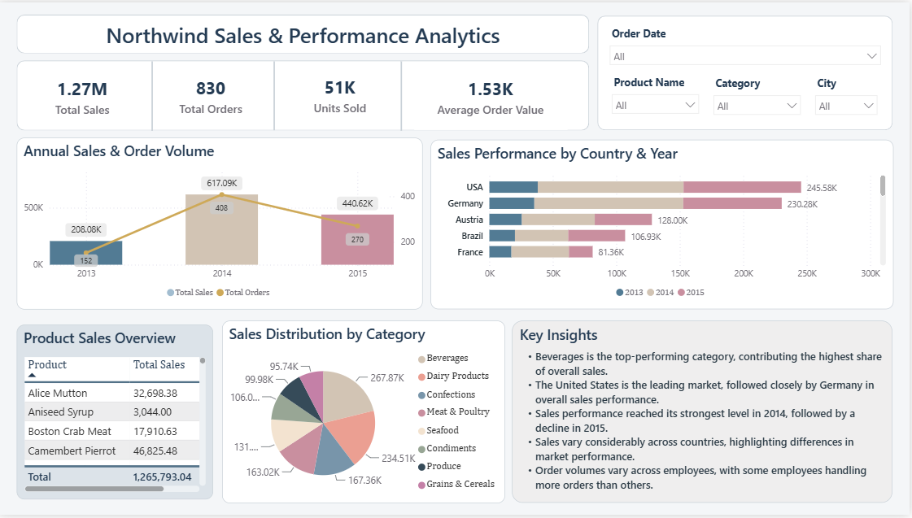
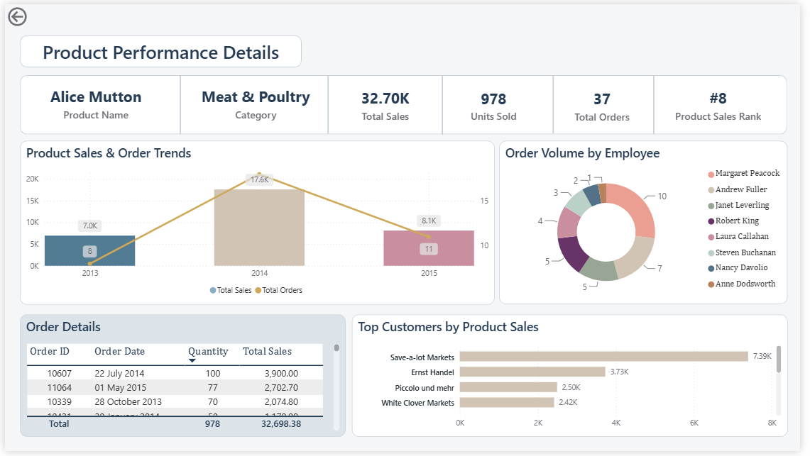

# Northwind Sales & Performance Analytics

An interactive Power BI dashboard developed to analyze sales performance, product performance, customer behavior, and order trends using the Northwind dataset.

The project focuses on transforming raw business data into an interactive and visually clear analytical dashboard that supports business decision-making and helps identify meaningful patterns and insights.

## Project Objectives

The main objectives of this project were to:

- Analyze overall sales performance.
- Identify top-performing products and customers.
- Monitor sales trends over time.
- Analyze order and quantity patterns.
- Provide interactive filtering and product-level drill-through analysis.
- Extract meaningful business insights from the data.

## Dataset

The project uses the Northwind dataset, a sample business dataset that contains information related to customers, orders, products, categories, employees, and shipping.

The dataset was used to analyze sales performance, order trends, product performance, customer behavior, and geographical sales distribution.

The source data files used in this project are available in the data folder as a ZIP file.

## Data Preparation & Cleaning

The dataset was prepared and reviewed using Power Query before developing the data model and dashboard.

The following data quality checks and transformations were performed:

- **Null Value Analysis:**  Null values were reviewed based on their business meaning.
  
   Logical nulls were retained when they represented valid situations in the dataset rather than missing or incorrect data.

- **Duplicate Check:** The data was checked for duplicate records to ensure data integrity and avoid potential double counting.

- **Data Type Validation:** Column data types were reviewed and verified to ensure that each field used an appropriate data type.

- **Date Formatting:** Date fields were checked to ensure that they were correctly recognized and formatted as dates for time-based analysis.

- **Numeric Formatting:** Numeric fields such as quantity, unit price, discount, and freight were reviewed to ensure appropriate numeric data types and formatting.

## Data Modeling

The data model was reviewed before developing the dashboard.

Although Power BI automatically identified relationships between some tables, the relationships were manually checked to ensure that:

- The correct columns were related.
- Relationship cardinalities were appropriate.
- Relationships were functioning correctly.
- Fact and dimension tables were properly understood.
- Relationships were correctly considered when creating DAX calculations and visualizations.

This ensured that dashboard calculations and visual interactions were based on the correct data relationships.

## DAX Calculations

Several DAX measures and calculated columns were created to support the analysis and provide meaningful analytical metrics.

### Measures
| Measure | Purpose|
|:---|:---|
|*1. Total Sales*| Calculates the overall sales value and serves as a primary sales measure.|
|*2. Total Orders*| Measures the total number of orders.|
|*3. Units Sold*| Calculates the total quantity of products sold.|
|*4. Total Freight*| Calculates the total freight cost associated with orders.|
|*5. Average Order Value*| Calculates the average sales value per order.|
|*6. Average Units per Order*| Calculates the average number of units included in each order.|
|*7. Product Sales Rank*| Ranks products based on their total sales performance.|
|*8. Product Sales Rank Display*| Formats the numerical product rank for presentation, such as #12.|
|*9. Average Sales per Product*| Calculates the average sales value across products.|

### Calculated Columns

Additional calculated columns were created using **DAX**:

**1. Year:** Extracts the year from the order date.

**2. Shipping Status:** Classifies orders based on their shipping status.

**3. Gross Sales:** Calculates sales before applying discounts.

**4. Discount Amount:** Calculates the monetary value of the applied discount.

These calculated columns were created as additional analytical fields, although they were not all used directly in the final dashboard visuals.

## Dashboard Development

The dashboard was designed to provide an interactive overview of sales and business performance.

The following Power BI visualizations were used:

- **Cards:** Provide a quick overview of Total Sales, Total Orders, Units Sold, and Average Order Value.
- **Line and Clustered Column Chart:** Shows annual sales performance alongside order volume, making it easier to compare changes in sales and orders over time.
- **Stacked Bar Chart:** Compares sales performance across countries and years.
- **Pie Chart:** Shows the distribution of total sales across product categories.
- **Tables:** Provide a detailed view of sales performance across individual products and order-level details.
- **Slicers:** Allow users to interactively filter the dashboard by Product Name, Order Date, Category, and City.
- **Donut Chart:** Displays the distribution of orders for a selected product orders across employees.

#### Visual Interactions

Visual interactions were reviewed and tested to ensure that filtering and cross-highlighting behaved correctly across the dashboard.

This ensures that selecting a value in one visual appropriately affects other related visuals and provides a consistent interactive experience.

## Dashboard Pages

### 1. Main Dashboard

The Main Dashboard provides a high-level overview of business performance, including:

- Overall sales metrics.
- Sales trends over time.
- Product performance.
- Interactive filtering.
- Key business insights.

### 2. Product Performance Details

The Product Performance Details page provides a detailed analysis of individual product performance.

Users can explore a selected product and view key information including product name, category, total sales, units sold, total orders, and product sales rank.

The page also includes:

- Product sales and order trends to analyze product performance over time.
- Order distribution by employee to identify employees handling the highest number of orders.
- Order details to provide transaction-level information.
- Top customers by product sales to identify customers generating the highest revenue for the selected product.

🔙 A Back button was also added to provide easy navigation from the Product Details page back to the Main Dashboard.

This page allows users to drill down from overall business performance into detailed product-level analysis.

## Dashboard Preview
### Sales & Performance Overview



### Product Performance Details



## Key Insights

The dashboard was analyzed to identify meaningful business patterns and insights, including observations related to:

- Overall sales performance.
- Product performance and sales rankings.
- Customer contribution to sales.
- Order and quantity patterns.
- Changes in sales over time.

The Key Insights section summarizes key findings from the analysis into concise, business-oriented observations based on the dashboard visuals.

## Tools & Technologies

- **Microsoft Power BI**
- **Power Query**
- **DAX**
- **Data Cleaning & Transformation**
- **Data Modeling**
- **Data Visualization**
- **Interactive Dashboard Design**
- **Business-Oriented Data Analysis**

## Key Skills Demonstrated

- Data cleaning and validation.
- Data transformation using Power Query.
- Data modeling and relationship validation.
- Understanding of fact and dimension tables.
- DAX measures, calculated columns, and business metric development.
- Interactive dashboard design.
- Data visualization.
- Drill-through functionality.
- Visual interaction and filtering.
- Business-oriented data analysis and insight generation.

## Project Structure

```text
Northwind-Sales-Performance-Analytics/
│
├── README.md
│
├── Northwind Sales & Performance Analytics.pbix
│
├── data/
│   └── Northwind+Traders.zip
│
└── images/
    ├── dashboard-overview.png
    ├── product-details.png
    └── model-view.png

```
## Project Purpose

This project demonstrates the process of taking a structured business dataset through data preparation, data modeling, DAX development, visualization, and interactive dashboard design to produce an analytical solution that communicates business performance and insights effectively.

